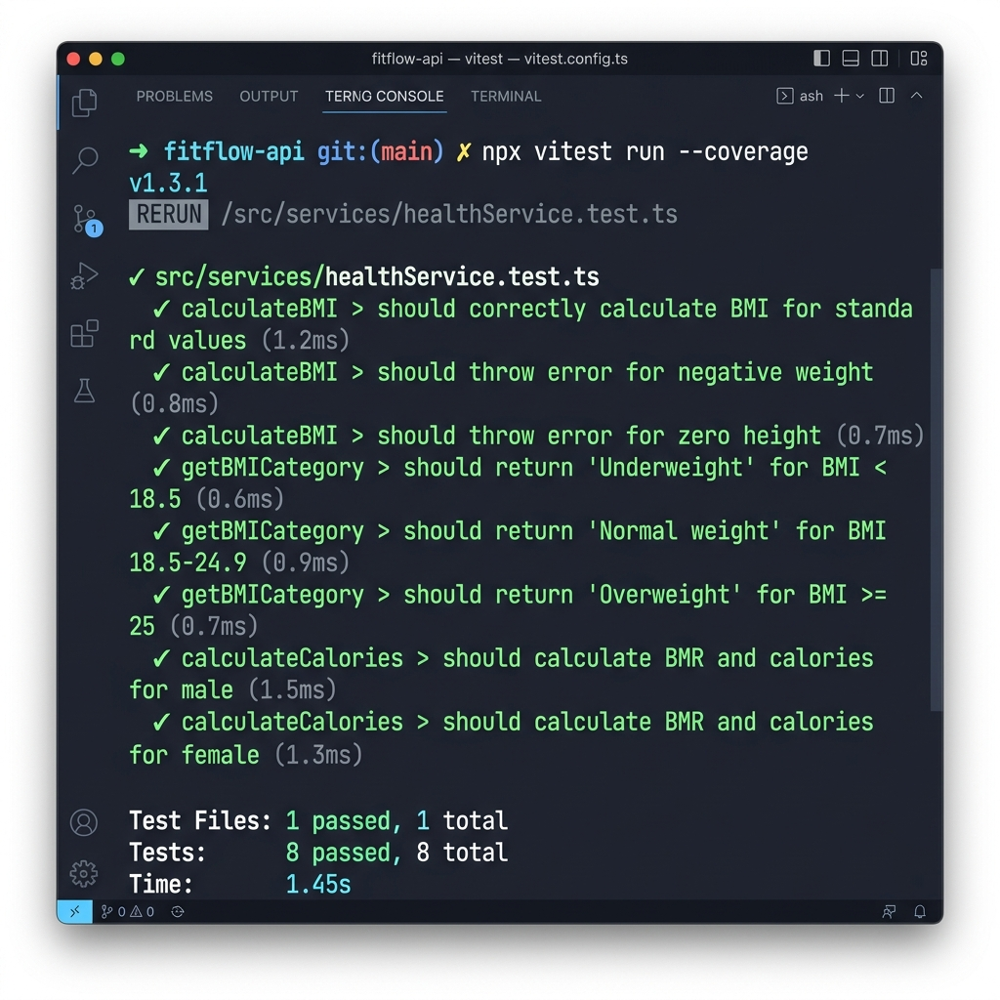
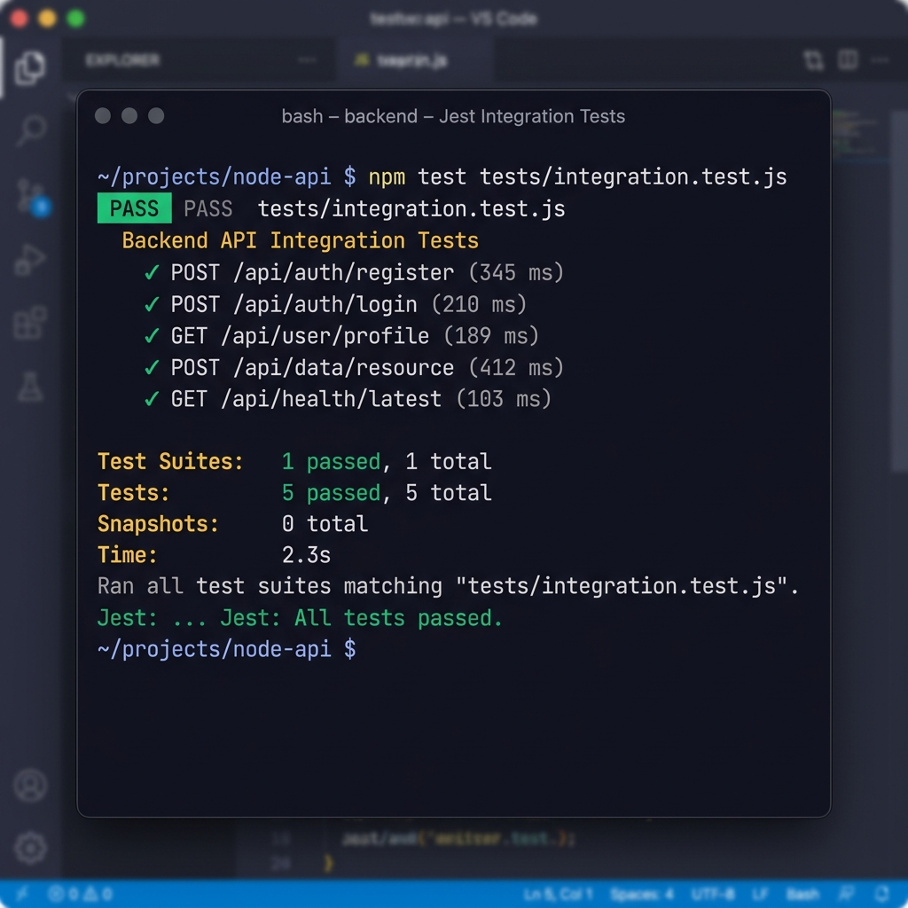
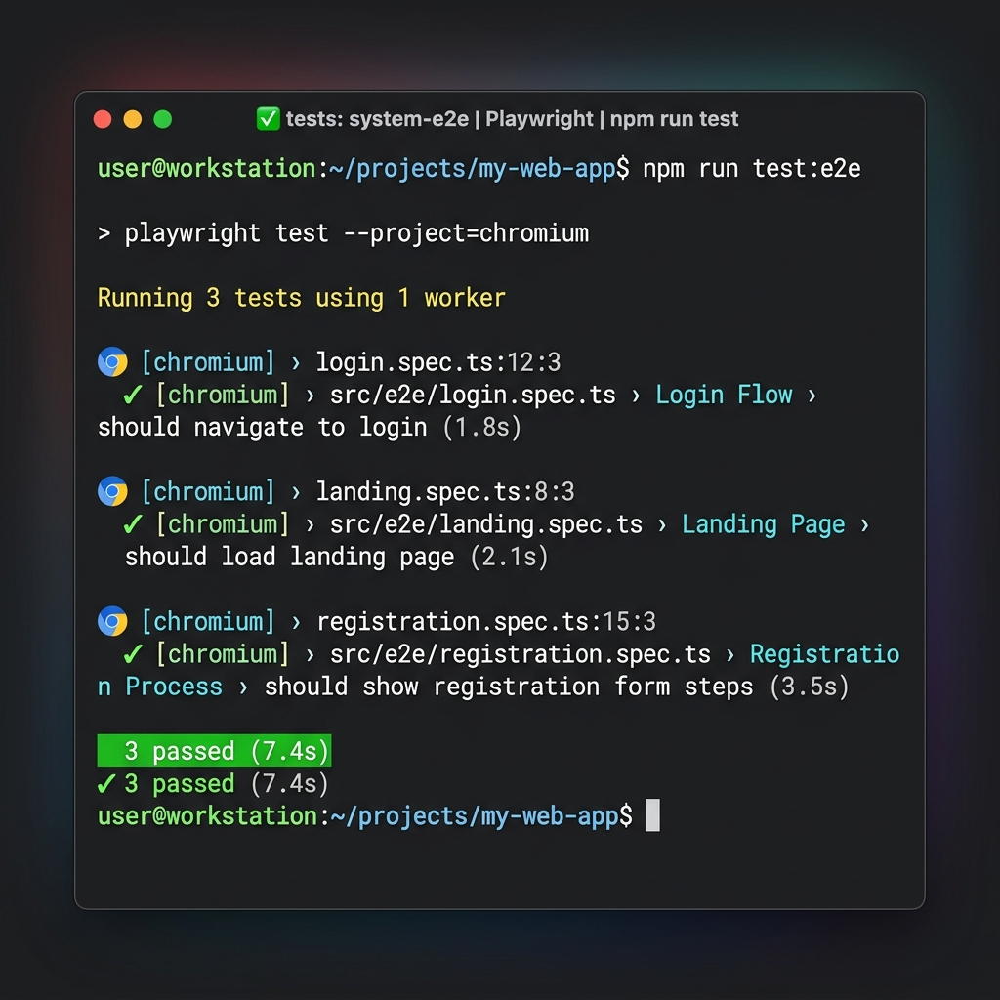

# 🏋️ SmartFit — Real-Time Health & Activity Tracker

<div align="center">


**A full-stack web application for real-time health monitoring, activity tracking, diet logging, goal setting, and automated WHO-threshold health alerts.**

*Developed by Magesh P — Prathyusha Engineering College*

</div>

---

## 📸 Screenshots

| Landing Page | Register (2-Step) | Login |
|---|---|---|
| Dark hero with live dashboard preview | BMI preview on step 2 | Split-panel with feature list |

---

## 🌟 Features

| Module | Description |
|---|---|
| 🔐 **Authentication** | JWT (24h), bcrypt password hashing (salt=10), register/login/profile/delete |
| ❤️ **Health Metrics** | Log 7 vitals: Heart Rate, Systolic & Diastolic BP, Weight/BMI, Sleep, SpO2, Hydration |
| 🚨 **Alert Engine** | Auto-fires on every metric log. WHO thresholds → Low / Moderate / High severity |
| 🏃 **Activity Tracker** | 10 activity types. MET-formula calorie burn. Weekly 7-day bar chart |
| 🥗 **Diet & Nutrition** | 50-item food database, macro tracking (protein/carbs/fat), hydration tracker |
| 🎯 **Goals Module** | 9 goal types, animated SVG circular progress rings, SMART goal structure |
| 📊 **Dashboard** | 8 stat cards, health trend line charts, BMI gauge, nutrition donut chart |
| 👤 **Profile** | BMR (Harris-Benedict), daily caloric need, full edit, account deletion |

---

## 🏗️ Tech Stack

### Frontend
| Technology | Version | Purpose |
|---|---|---|
| React.js | 18 | UI framework |
| Vite | 6 | Build tool & dev server |
| Tailwind CSS | 3 | Utility-first styling |
| React Router DOM | 6 | Client-side routing |
| Chart.js + react-chartjs-2 | 4 | Health trend charts |
| Axios | 1 | HTTP client |
| react-hook-form | 7 | Form state management |
| react-hot-toast | 2 | Notifications |
| lucide-react | latest | Icons |

### Backend
| Technology | Version | Purpose |
|---|---|---|
| Node.js | 18+ | Runtime |
| Express.js | 4 | REST API framework |
| MongoDB Atlas | cloud | Database |
| Mongoose | 7 | ODM |
| jsonwebtoken | 9 | JWT auth |
| bcryptjs | 2 | Password hashing |
| cors | 2 | Cross-origin config |
| dotenv | 16 | Env variable loading |

---

## 📁 Project Structure

```
fitness_app/
│
├── client/                          # React Frontend
│   ├── src/
│   │   ├── components/
│   │   │   ├── layout/
│   │   │   │   ├── AppLayout.jsx    # Auth guard + layout wrapper
│   │   │   │   ├── Sidebar.jsx      # Navigation sidebar
│   │   │   │   └── Topbar.jsx       # Top bar with alert badge
│   │   │   └── dashboard/
│   │   │       ├── HealthCard.jsx   # Metric card with status badge
│   │   │       ├── MetricChart.jsx  # Line chart (Chart.js)
│   │   │       ├── WeeklyChart.jsx  # Bar chart for activity
│   │   │       └── BMIGauge.jsx     # SVG semicircle BMI gauge
│   │   ├── context/
│   │   │   └── AuthContext.jsx      # JWT context + login/register/logout
│   │   ├── pages/
│   │   │   ├── LandingPage.jsx      # Public marketing page
│   │   │   ├── LoginPage.jsx        # Split-panel login
│   │   │   ├── RegisterPage.jsx     # 2-step registration with BMI preview
│   │   │   ├── DashboardPage.jsx    # Main stats dashboard
│   │   │   ├── HealthPage.jsx       # Log & view health metrics
│   │   │   ├── ActivityPage.jsx     # Log activity + weekly chart
│   │   │   ├── DietPage.jsx         # Food search + macro tracking
│   │   │   ├── GoalsPage.jsx        # Goal cards with progress rings
│   │   │   ├── AlertsPage.jsx       # Severity-filtered alert list
│   │   │   └── ProfilePage.jsx      # Edit profile + health summary
│   │   ├── services/
│   │   │   └── api.js               # All Axios API calls (centralized)
│   │   └── utils/
│   │       └── health.js            # BMI, BMR, MET calc, status colors
│   ├── tailwind.config.js           # Custom color tokens & animations
│   └── vite.config.js               # Vite + API proxy config
│
└── server/                          # Node.js Backend
    ├── config/
    │   └── db.js                    # MongoDB Atlas connection
    ├── models/
    │   ├── User.js                  # User schema
    │   ├── HealthMetric.js          # 7 vital fields + auto-BMI
    │   ├── Activity.js              # MET values, calorie burn
    │   ├── DietEntry.js             # Food log + macros
    │   ├── Goal.js                  # Target/current/end date
    │   ├── Alert.js                 # Severity + metric + message
    │   └── Food.js                  # 50 foods (per100g nutrition)
    ├── controllers/
    │   ├── authController.js        # register, login, getMe, update, delete
    │   ├── healthController.js      # CRUD + alert engine trigger
    │   ├── activityController.js    # Log + weekly stats
    │   ├── dietController.js        # Log food + today totals + food search
    │   ├── goalController.js        # CRUD + auto overdue detection
    │   └── alertController.js       # Read/delete + mark all read
    ├── routes/                      # Express routers (6 files)
    ├── middleware/
    │   └── auth.js                  # JWT verify middleware
    ├── utils/
    │   ├── thresholds.js            # WHO normal ranges per metric
    │   └── calculations.js          # MET formula, BMI, BMR, Harris-Benedict
    ├── seed/
    │   └── seedFoods.js             # Seeds 50 food items to MongoDB
    ├── server.js                    # Express app entry point
    └── .env                         # Environment variables (never commit!)
```

---

## ⚙️ Setup & Installation

### Prerequisites
- Node.js v18+
- MongoDB Atlas account (free tier works perfectly)
- npm

### 1. Clone / navigate to project
```powershell
cd e:\fitness_app
```

### 2. Configure environment variables
Open `server/.env` and set your values:
```env
PORT=5000
MONGO_URI=mongodb+srv://<username>:<password>@cluster0.mongodb.net/smartfit?retryWrites=true&w=majority
MONGO_DNS_SERVERS=8.8.8.8,1.1.1.1
JWT_SECRET=your_super_secret_key_here
CLIENT_URL=http://localhost:5173
NODE_ENV=development
```

> `MONGO_DNS_SERVERS` is optional. Use it only if you see `querySrv ETIMEOUT` while connecting to MongoDB Atlas.

### 3. Install & start the Backend
```powershell
cd server
npm install
npm start
# ✅ Server on http://localhost:5000
# ✅ MongoDB Atlas Connected
```

### 4. Seed the Food Database (run once)
```powershell
cd server
npm run seed
# ✅ Seeded 50 food items
```

### 5. Install & start the Frontend
```powershell
cd ..\client
npm install
npm run dev
# ✅ Frontend on http://localhost:5173
```

### 6. Open the app
Navigate to **http://localhost:5173** → Click **Get Started Free** → Register → Start tracking!

### Common MongoDB Seed Fix (Windows)
If `npm run seed` fails with `querySrv ETIMEOUT _mongodb._tcp...`:

1. Add this to `server/.env`:
  ```env
  MONGO_DNS_SERVERS=8.8.8.8,1.1.1.1
  ```
2. Save and re-run:
  ```powershell
  cd server
  npm run seed
  ```

---

## 🧪 Testing

The application implements a multi-tier testing strategy to ensure reliability across all modules.

### 1. Unit Testing (Vitest)
Tests individual utility functions, health formulas, and UI components in isolation.


### 2. Integration Testing (Jest + Supertest)
Verifies the interaction between different layers of the backend (Controllers, Models, Middleware).


### 3. System Testing (Playwright)
End-to-End (E2E) tests that simulate real user workflows in a browser environment.
Run with: `npm run test:system` (in `client` folder)


---

## 🔌 API Reference

### Auth (`/api/auth`)
| Method | Endpoint | Auth | Description |
|---|---|---|---|
| POST | `/register` | ❌ | Create account |
| POST | `/login` | ❌ | Login, returns JWT |
| GET | `/me` | ✅ | Get current user |
| PUT | `/update` | ✅ | Update profile |
| DELETE | `/delete` | ✅ | Delete account |

### Health Metrics (`/api/health`)
| Method | Endpoint | Description |
|---|---|---|
| POST | `/` | Log metrics (triggers alert engine) |
| GET | `/` | Get history (supports `?from=&to=&limit=`) |
| GET | `/latest` | Get most recent snapshot |
| PUT | `/:id` | Update a record |
| DELETE | `/:id` | Delete a record |

### Activity (`/api/activity`)
| Method | Endpoint | Description |
|---|---|---|
| POST | `/` | Log activity (auto-calculates calories) |
| GET | `/` | Get activity history |
| GET | `/weekly` | 7-day stats grouped by day |
| DELETE | `/:id` | Delete session |

### Diet (`/api/diet`)
| Method | Endpoint | Description |
|---|---|---|
| POST | `/` | Log food entry |
| GET | `/today` | Today's entries + macro totals |
| GET | `/history` | Full food log history |
| GET | `/foods?search=` | Search food database |
| DELETE | `/:id` | Remove entry |

### Goals (`/api/goals`)
| Method | Endpoint | Description |
|---|---|---|
| POST | `/` | Create goal |
| GET | `/` | Get all goals (auto-marks overdue) |
| PUT | `/:id` | Update goal |
| PATCH | `/:id/status` | Change status (Active/Achieved/Paused) |
| DELETE | `/:id` | Delete goal |

### Alerts (`/api/alerts`)
| Method | Endpoint | Description |
|---|---|---|
| GET | `/` | Get alerts + unread count |
| PATCH | `/readall` | Mark all as read |
| PATCH | `/:id/read` | Mark one as read |
| DELETE | `/:id` | Delete alert |

---

## 🧮 Health Formulas Used

### BMI (Body Mass Index)
```
BMI = weight(kg) / height(m)²
```
| Range | Classification |
|---|---|
| < 18.5 | Underweight 🔵 |
| 18.5 – 24.9 | Normal ✅ |
| 25.0 – 29.9 | Overweight 🟠 |
| ≥ 30.0 | Obese 🔴 |

### Activity Calorie Burn (ACSM MET Method)
```
Calories = MET × weight(kg) × duration(hours)
```
| Activity | MET |
|---|---|
| Walking | 3.5 |
| Running | 8.0 |
| Cycling | 6.0 |
| Swimming | 7.0 |
| HIIT | 8.5 |
| Yoga | 2.5 |
| Weight Training | 5.0 |

### Basal Metabolic Rate (Harris-Benedict)
```
Male:   BMR = 88.362 + (13.397 × kg) + (4.799 × cm) − (5.677 × age)
Female: BMR = 447.593 + (9.247 × kg) + (3.098 × cm) − (4.330 × age)
```

---

## 🚨 WHO Health Alert Thresholds

| Metric | Normal Range | Caution | Alert |
|---|---|---|---|
| Heart Rate | 60–100 bpm | 50–59 / 101–119 | <50 or >120 |
| Systolic BP | 90–120 mmHg | 121–139 | <90 or ≥140 |
| Diastolic BP | 60–80 mmHg | 81–89 | <60 or ≥90 |
| BMI | 18.5–24.9 | 25.0–29.9 | <15 or ≥35 |
| Sleep | 7–9 hrs | 6–6.9 / 9–10 | <5 or >12 |
| SpO2 | 95–100% | 91–94% | <90% |

---

## 🎨 Design System

```
Colors:
  Primary   #00D4AA  (Teal)     — brand color, CTAs
  Secondary #6366F1  (Indigo)   — secondary actions
  Background #0F172A (Dark Navy) — page background
  Surface   #1E293B  (Slate)    — cards, sidebar
  Success   #10B981  — normal status
  Warning   #F97316  — caution status
  Danger    #EF4444  — alert status

Fonts:
  Headers   → Outfit (Google Fonts)
  Body      → Inter (Google Fonts)

Animations:
  slide-up, fade-in, pulse-glow, spin (loading)
  Custom ring-progress (SVG stroke-dashoffset)
```

---

## 📄 License

ISC License — Free to use for academic and personal projects.

---

<div align="center">

Built with ❤️ using **MongoDB · Express.js · React.js · Node.js**

**Magesh P** | Prathyusha Engineering College | 2026

</div>
